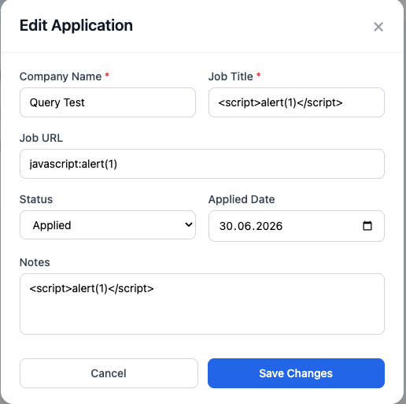
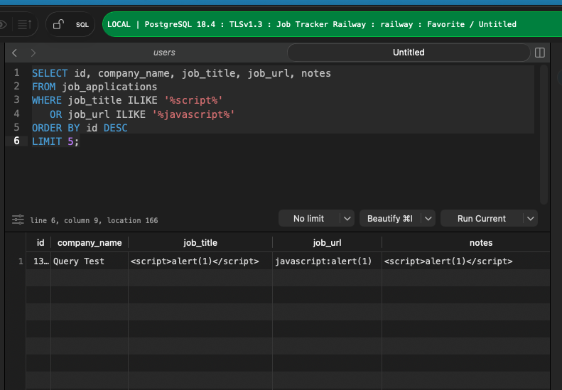
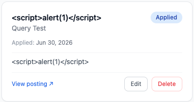
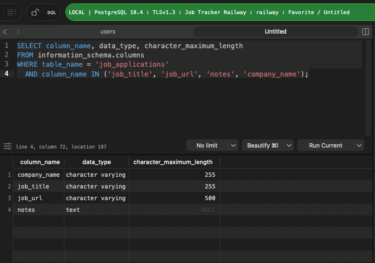

# Security Defence Mechanisms & Penetration Testing — Job Tracker

Manual penetration testing and defence verification conducted against the live
production Job Tracker application. Tests were performed layer by layer against
the deployed frontend at `job-tracker-frontend-green-sigma.vercel.app`. Each
layer is tested independently — a finding in one layer does not compromise the
others. This is the defence-in-depth model.

---

## Why This Document Exists

Manual pen testing was conducted to verify that each defence layer works as
intended in production, not just in code. Passing tests at the code level (unit
tests, linting, static analysis) confirm intent — they do not confirm that
headers are actually served, that React escaping cannot be bypassed in the
deployed build, or that cookies arrive with the correct flags in a real browser
session. Each test session recorded here is evidence that the defence is active
in production at the time of testing.

This document also serves as a reference for understanding the full attack
surface of the application — which vectors are covered, which mechanisms cover
them, and which areas remain to be tested.

---

## Key Source Files

| File | Repo | Layer | What it defends |
|------|------|-------|-----------------|
| `vercel.json` | job-tracker-frontend | Layer 1 | HTTP security headers deployed on every response |
| `src/components/jobs/JobCard.jsx` | job-tracker-frontend | Layer 2b | Explicit `javascript:` and `data:` protocol blocklist in `getAbsoluteUrl()` |
| All JSX render files | job-tracker-frontend | Layer 2 | React auto-escaping of all `{variable}` interpolations |
| Backend cookie config | job-tracker-backend | Layer 4 | `httpOnly`, `Secure`, `SameSite=Lax` session cookie flags |

---

## Defence Layers

### Layer 1 — HTTP Security Headers

The primary defence against a wide range of injection and framing attacks is the
set of HTTP response headers configured in `vercel.json`. These headers are
evaluated by the browser on every response before any JavaScript executes —
meaning they cannot be bypassed by injected scripts, DOM manipulation, or
client-side logic. Because they are set at the CDN/hosting layer (Vercel), they
apply uniformly to every route, every asset, and every user session.

**Key file:** `vercel.json`

**Tests conducted:**

#### Test 1 — Header verification via curl

```bash
curl -I https://job-tracker-frontend-green-sigma.vercel.app
```

Result: all five headers confirmed present in every production response.

| Header | Value | What it prevents |
|--------|-------|------------------|
| `content-security-policy` | `default-src 'self'; script-src 'self'; ...` | Script injection from unknown origins |
| `x-frame-options` | `DENY` | Clickjacking via iframe embedding |
| `x-content-type-options` | `nosniff` | MIME type sniffing attacks |
| `referrer-policy` | `strict-origin-when-cross-origin` | Sensitive URL path leaking to third parties |
| `permissions-policy` | `camera=(), microphone=(), geolocation=()` | Silent browser API activation by injected scripts |

> Bonus finding: Vercel automatically adds `Strict-Transport-Security`
> (HSTS) — `max-age=63072000; includeSubDomains; preload`. This was not
> configured in `vercel.json` but appears in every response. It closes the
> SSL stripping attack vector by forcing HTTPS at the browser level before
> a request even leaves the device.

#### Test 2 — Clickjacking iframe test

Method: local HTML file simulating an attacker page attempting to embed the
application inside an iframe. Two scenarios tested.

| Scenario | iframe src | Result | Reason |
|----------|-----------|--------|--------|
| A | `job-tracker-frontend-green-sigma.vercel.app` | Blocked — broken document icon, "refused to connect" | Server returned `X-Frame-Options: DENY` |
| B | `example.com` | Loaded normally inside frame | No framing restriction headers present |

> Same browser. Same HTML file. Same iframe tag. The only variable was
> the server response header — proving the protection is entirely
> server-driven, not browser-driven.

Scenario A — attacker attempts to embed Job Tracker:

```html
<!DOCTYPE html>
<html>
  <body>
    <h2>Clickjacking test</h2>
    <iframe
      src="https://job-tracker-frontend-green-sigma.vercel.app"
      width="900"
      height="600">
    </iframe>
  </body>
</html>
```

Scenario B — control test with unprotected site:

```html
<!DOCTYPE html>
<html>
  <body>
    <h2>Clickjacking test</h2>
    <iframe
      src="https://example.com"
      width="900"
      height="600">
    </iframe>
  </body>
</html>
```

**Status:** tested and verified in production

---

### Layer 2 — React JSX Auto-escaping

React escapes all dynamic content rendered via `{variable}` interpolation in
JSX before it reaches the DOM. Any user-supplied string — job title, company
name, notes — is treated as text, not markup. Characters such as `<`, `>`, `"`,
and `&` are converted to their HTML entity equivalents, preventing an attacker
from injecting a `<script>` tag or event handler attribute through a form field.
This escaping happens at the framework level in `react-dom`, not in application
code, which means it applies to every JSX render file in `src/` without
requiring any per-field sanitisation.

**Key file:** all JSX render files in `src/`

**Tests conducted:**

#### Test 1 — Stored XSS payload via form fields

Malicious input was submitted through each text field in the application: job title,
company name, notes, and email. The XSS payload used:

```
<script>alert(1)</script>
```

The value was stored in the database exactly as entered (see Layer 3 — no server-side
sanitisation). On re-render, the job card displayed the raw string as visible text. The
`<` and `>` characters were converted to `&lt;` and `&gt;` by React's `react-dom`
renderer before reaching the DOM. No alert dialog appeared. The script tag was never
executed.

| Field tested | Payload | Rendered as | Script executed |
|-------------|---------|-------------|----------------|
| Job title | `<script>alert(1)</script>` | Plain text string | No |
| Company name | `<script>alert(1)</script>` | Plain text string | No |
| Notes | `<script>alert(1)</script>` | Plain text string | No |
| Email | `<script>alert(1)</script>` | Plain text string | No |

#### Test 2 — grep for dangerouslySetInnerHTML

`dangerouslySetInnerHTML` is React's escape hatch that bypasses auto-escaping and injects
raw HTML directly into the DOM. Its presence anywhere in the codebase would void Layer 2's
protection for affected components.

```bash
grep -r "dangerouslySetInnerHTML" src/
```

Result: no output — `dangerouslySetInnerHTML` is not used anywhere in the codebase. React
auto-escaping is unbroken across all files in `src/`.

#### Test 3 — Semgrep static analysis (p/react ruleset)

Semgrep was run against the full `src/` directory using the official React security ruleset
to detect known React security anti-patterns, including unsafe HTML injection, unvalidated
redirects, and prop drilling of dangerous values.

```bash
semgrep --config "p/react" src/
```

| Metric | Value |
|--------|-------|
| Semgrep version | 1.165.0 |
| Ruleset | `p/react` |
| Rules run | 4 |
| Files scanned | 23 |
| Findings | 0 |

Result: zero findings across all rules and all files. No known React security anti-patterns
are present in the codebase.

**Status:** tested and verified in production

---

### Layer 2b — getAbsoluteUrl Protocol Blocklist

Job URLs submitted by users are rendered as `<a href="...">` links in
`JobCard.jsx`. Without validation, an attacker could store a `javascript:` URI
as the job URL — a classic stored XSS vector that executes arbitrary JavaScript
when the link is clicked. The `getAbsoluteUrl()` function applies an explicit
allowlist-by-exclusion: `javascript:` and `data:` URIs are intercepted and
replaced with `'#'` before the value ever reaches the `href` attribute. Only
`http://` and `https://` URIs pass through unchanged; bare URLs receive an
`https://` prefix.

**Key file:** `src/components/jobs/JobCard.jsx`

**Tests conducted:**

#### Test 1 — Attack surface mapping

Before payload testing, all input fields and all rendering contexts were enumerated
systematically. For each input field, the rendering destination was identified:

| Input field | Rendering context | Sink type |
|------------|------------------|-----------|
| Job title | JSX `{variable}` | Text node — auto-escaped by React |
| Company name | JSX `{variable}` | Text node — auto-escaped by React |
| Notes | JSX `{variable}` | Text node — auto-escaped by React |
| Job URL | `<a href={...}>` attribute | **Attribute sink — not text-escaped** |

The job URL field was identified as a distinct attack surface: unlike text nodes, `href`
attributes accept executable protocols (`javascript:`, `data:`). React auto-escaping
converts `<` and `>` but does not strip dangerous URI schemes from attribute values. The
`href` attribute is a DOM sink — the browser interprets it directly when the user clicks
the link, with no further sanitisation.

#### Test 2 — Stored `javascript:` payload

A `javascript:` URI was submitted as the job URL field and saved to the database:

```
javascript:alert(1)
```

The database stored the value as a plain string — no rejection, no sanitisation. The threat
only manifests at render time in the browser. Without the `getAbsoluteUrl()` fix, clicking
the job link would execute `alert(1)`.

**XSS classification:** stored + DOM-based — the payload is persisted to the database
(stored), and execution occurs in the DOM when the link is clicked (DOM-based). The server
is uninvolved in the execution path.

#### Test 3 — Fix verification (`getAbsoluteUrl()` blocklist)

The `getAbsoluteUrl()` function in `src/components/jobs/JobCard.jsx` intercepts the value
before it reaches the `href` attribute:

| Input URL | Matched rule | Output |
|----------|-------------|--------|
| `javascript:alert(1)` | `/^javascript:/i` | `#` (harmless anchor) |
| `data:text/html,<script>...` | `/^data:/i` | `#` (harmless anchor) |
| `https://example.com` | `/^https?:\/\//i` | `https://example.com` (unchanged) |
| `example.com` | fallback | `https://example.com` (prefix added) |

After the fix, clicking a job card link with a `javascript:` URL navigates to `#` — no
script execution, no alert dialog.

**Status:** tested and verified in production

---

### Layer 3 — Database Raw Storage

The database stores user-supplied content exactly as submitted — no escaping,
no sanitisation, no content filtering at the persistence layer. This is
intentional: the database is not the place to enforce display-layer security.
The risk this creates is that if any future code path renders stored content
outside of React (e.g. a server-side template, an email renderer, or an admin
panel built with a different framework), that path would need its own
escaping layer. The defence here is therefore a constraint: all rendering
paths must go through React JSX.

**Key file:** `job-tracker-backend/models/` (SQLAlchemy models), PostgreSQL schema

**Tests conducted:**

#### Test 1 — Stored payload round-trip verification

An XSS payload was submitted through the Add Application form and saved.

| Field | Submitted payload |
|-------|-------------------|
| Job Title | `<script>alert(1)</script>` |
| Job URL | `javascript:alert(1)` |
| Notes | `<script>alert(1)</script>` |

The Edit Application form — populated from the database on load — displays
the payload exactly as submitted, confirming the value round-trips through
storage and retrieval unmodified.



A direct SQL query against `job_applications` confirms the same value is
sitting raw in the database:

```sql
SELECT id, company_name, job_title, job_url, notes
FROM job_applications
WHERE job_title ILIKE '%script%'
   OR job_url ILIKE '%javascript%'
ORDER BY id DESC
LIMIT 5;
```



| Field | Stored value | Matches submitted payload |
|-------|-------------|---------------------------|
| job_title | `<script>alert(1)</script>` | Yes |
| job_url | `javascript:alert(1)` | Yes |
| notes | `<script>alert(1)</script>` | Yes |

No escaping, encoding, or rejection occurred at any point between submission
and storage.

> For reference, this is the same payload from Layer 2 / Layer 2b testing.
> The database stores it raw (above); React and `getAbsoluteUrl()` neutralise
> it only at render time:
>
> 

#### Test 2 — Schema constraint inspection

To confirm the absence of content filtering is a deliberate design choice
rather than an oversight, the column definitions for the affected fields were
inspected directly:

```sql
SELECT column_name, data_type, character_maximum_length
FROM information_schema.columns
WHERE table_name = 'job_applications'
  AND column_name IN ('job_title', 'job_url', 'notes', 'company_name');
```



| Column | Data type | Max length | Content validation |
|--------|-----------|-----------|---------------------|
| company_name | character varying | 255 | None |
| job_title | character varying | 255 | None |
| job_url | character varying | 500 | None |
| notes | text | unlimited | None |

The only constraint present is length. There is no `CHECK` constraint,
trigger, or other database-level mechanism filtering content. This confirms
the database layer is intentionally unopinionated about content —
sanitisation is the render layer's responsibility (Layer 2 / 2b), not the
storage layer's.

**Status:** tested and verified in production

---

### Layer 4 — httpOnly Session Cookies

Authentication tokens are stored in cookies rather than `localStorage` or
`sessionStorage`. Three cookie flags are critical to this defence:

- `httpOnly` — prevents JavaScript from reading the cookie via `document.cookie`, blocking token theft by injected scripts
- `Secure` — prevents the cookie from being transmitted over plain HTTP connections
- `SameSite=Lax` — blocks the cookie from being sent in cross-site POST requests, mitigating CSRF

An attacker who successfully injects a script into the page cannot exfiltrate
the session token because `httpOnly` makes the cookie invisible to JavaScript
entirely.

**Key file:** backend authentication config

**Status:** TODO — not yet tested this session

---

## Defence-in-Depth Summary

| Attack vector | Method | Layer that stops it | Header/mechanism |
|--------------|--------|---------------------|-----------------|
| Script injection via input field | Stored XSS | Layer 2 | React JSX auto-escaping |
| Injected script from external origin | DOM XSS | Layer 1 | CSP `script-src 'self'` |
| `javascript:` URL in job link field | Protocol injection | Layer 2b | `getAbsoluteUrl()` blocklist |
| Embedding app in attacker iframe | Clickjacking | Layer 1 | `X-Frame-Options: DENY` |
| MIME type confusion attack | Content sniffing | Layer 1 | `X-Content-Type-Options: nosniff` |
| Token theft via injected script | Session hijacking | Layer 4 | `httpOnly` cookie flag |
| Cross-site form submission | CSRF | Layer 4 | `SameSite=Lax` cookie flag |
| Sensitive URL leaking to third parties | Referrer leaking | Layer 1 | `Referrer-Policy` header |
| Downgrade to HTTP connection | SSL stripping | Layer 1 (HSTS) | `Strict-Transport-Security` |

---

## Backlog

| Ticket | Description | Priority |
|--------|-------------|----------|
| JT-58 | Add password verification to `DELETE /users/me` and `PUT /users/me` email changes | High |
| JT-60 | Cross-user 403 forbidden tests for interview round endpoints | High |
| Future | Replace `status` varchar with PostgreSQL native enum to enforce valid values at DB layer | Medium |
| Future | Add Pydantic validators — `company_name` and `job_title` must start with a letter, `job_url` explicit protocol blocklist at API layer | Medium |

---

## Last Verified

Last verified: 2026-06-11
Environment: production — `job-tracker-frontend-green-sigma.vercel.app`
Tested by: Mustafa (QA-Master505)
